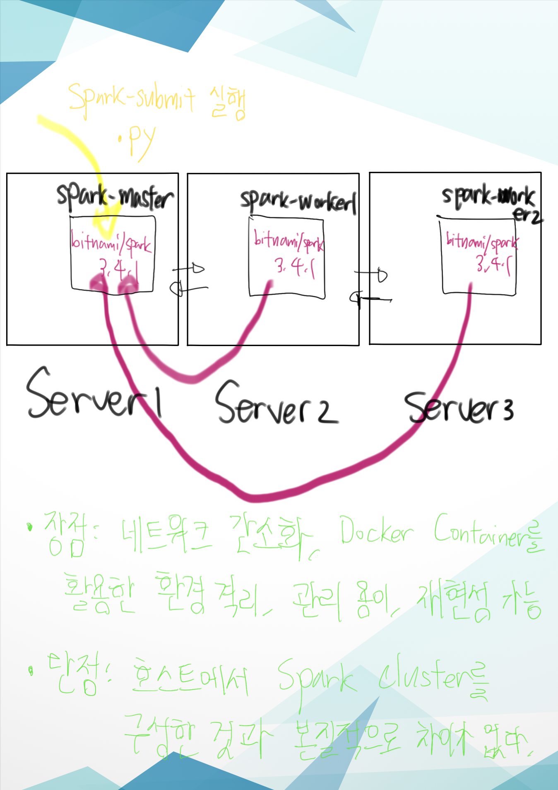
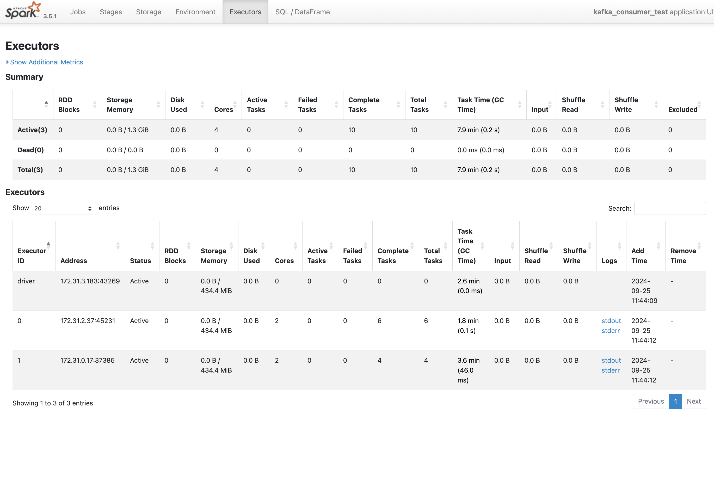

<h2> Spark </h2>

<h3> 사전 준비 사항 </h3>

- EC2와 같은 클라우드 서버 3대(Server 1, 2, 3)을 준비해서 서버들간 연결과 통신이 될 수 있도록 설정하는 작업이 필요하다. 

<br>

- 서버 1,2,3에 docker 프로그램이 설치되어야 한다.

<br>


<h3> Spark가 하는 역할 </h3>

- AWS S3에 실제 운영하는 BUCKET 안에 새로운 폴더 path(ex. version 2/)를 받아서 하위에 구성되어 있는 train/good, train/defective, test/good, test/defective 이미지들을 참고하여 정보 제공 성격의 JSON 데이터를 위해 병렬, 분산으로 처리하여 만드는 것이다. 

<br>

<h3> Spark Cluster 구조 에 대한 설명 </h3>

- Docker Host Network로 컨테이너를 띄우는 방식 
  - 본래 Bridge Network로 컨테이너를 띄우려 했지만 Cluster 구성하는 것이 Best 선택이었지만 구성이 되지 않아서 차선책으로 선택한 방법이다. 

  <br>

  - Server 1, 2, 3에 각각 Up된 컨테이너는 로컬과 다른 독립된 환경에서 실행되지만 포트 사용이나 자원 사용하는 측면에서 봤을 떄 로컬의 포트, 로컬의 자원을 사용한다고 보면 된다. 

  <br>

    

  <br>

  - Spark Worker들이 Spark Master에 연결이 되고 
    Spark Master에서 Spark Submit Job를 제출해서 Spark에서 제공하는 RDD나 Dataframe를 이용해서 병렬, 분산 처리한다. 

<br>


<h3> Spark Master Worker 이미지/컨테이너 구성을 위한 파일 설명  </h3>

- **Server 1**
  - dev 폴더에 있는 make_annotation.py 
    - Spark Submit Job를 제출할 떄 수행되는 파이썬 파일로 
      Kafka로부터 최신 폴더를 받고, 이미지들에 대한 정보 제공 데이터를 만드는 작업을 한다. 

  - Dockerfile 
    ```
    # 베이스 이미지로 bitnami/spark:3.5.1 사용
    FROM bitnami/spark:3.5.1

    # root 사용자 권한으로 전환
    USER root

    # 필요한 패키지 설치 (curl, wget, ping, net-tools 등) 및 boto3 설치
    RUN apt-get update && \
        apt-get install -y curl wget iputils-ping net-tools vim && \
        pip install boto3 Pillow

    # Kafka와 연동하기 위한 JAR 파일들을 wget으로 다운로드
    RUN wget -P /opt/bitnami/spark/jars \
        https://repo1.maven.org/maven2/org/apache/spark/spark-sql-kafka-0-10_2.12/3.5.0/spark-sql-kafka-0-10_2.12-3.5.0.jar && \
        wget -P /opt/bitnami/spark/jars \
        https://repo1.maven.org/maven2/org/apache/kafka/kafka-clients/3.5.0/kafka-clients-3.5.0.jar && \
        wget -P /opt/bitnami/spark/jars \
        https://repo1.maven.org/maven2/org/apache/commons/commons-pool2/2.11.0/commons-pool2-2.11.0.jar && \
        wget -P /opt/bitnami/spark/jars \
        https://repo1.maven.org/maven2/io/dropwizard/metrics/metrics-core/3.2.6/metrics-core-3.2.6.jar && \
        wget -P /opt/bitnami/spark/jars \
        https://repo1.maven.org/maven2/org/apache/spark/spark-token-provider-kafka-0-10_2.12/3.5.1/spark-token-provider-kafka-0-10_2.12-3.5.1.jar

    # Spark History Server를 켜기 위한 사전 설정을 한다. 
    COPY spark-defaults.conf /opt/bitnami/spark/conf/spark-defaults.conf

    # 작업 디렉토리를 /opt/bitnami/spark으로 설정
    WORKDIR /opt/bitnami/spark
    ```
    - Spark Master 이미지 자체의 환경을 정의한 파일 
      - 눈여겨 볼 것은 Spark Job를 수행하는 파이썬 파일에서 Kafka와 연동해야 하기 떄문에 Kafka 관련 JAR 파일들을 다운로드 받는다. 

      - Spark History Server를 켜려면 사전 작업이 필요한데 그것은 spark-defaults.conf를 /opt/bitmai/spark/conf/spark-defaults.conf에 COPY 하는 작업이다. 
        - 본래 Spark Master 컨테이너가 실행이 되면 Spark History Server도 자동적으로 켜려고 했지만 잘 안되었다. 따라서 수동으로 실행해야 한다. 

            ```
            # Spark Master 컨테이너에 내부 접속 후 명령어 실행 
            /opt/bitnami/spark/sbin/spark-history-server.sh
            ```
        - Spark History Server 란 
          - Spark Submit한 Job들에서 Worker들이 얼마나 일을 분배해서 처리했는지 자원은 얼마나 사용했는지를 보여주는 상세 웹 UI이다. 

          <br>

           
  
  <br>

  - docker-compose.yaml 

    ```
    # Spark Master Node를 Image로 만들고(최초) Container로 Up 하도록 정의
        ## Docker Container Up 할 떄 bridge network가 아니라 host network를 이용한다.  
        version: '3.8'
        services: 
        spark-master:
            build: 
            context: .  
            dockerfile: Dockerfile 
            container_name: spark-master
            environment:
            - SPARK_MODE=master
            - SPARK_MASTER_HOST=172.31.3.183
            - SPARK_MASTER_WEBUI_PORT=8085
            - SPARK_MASTER_PORT=7077
            - SPARK_RPC_AUTHENTICATION_ENABLED=no
            - SPARK_RPC_ENCRYPTION_ENABLED=no
            - SPARK_LOCAL_STORAGE_ENCRYPTION_ENABLED=no
            - SPARK_SSL_ENABLED=no
            - SPARK_USER=spark
            - BUCKET_TEST_NAME={{테스트 성격을 가진 AWS S3 BUCKET 이름}}  # 테스트 성격의 AWS S3-2 BUCKET
            - BUCKET_DEV_NAME={{실제로 쓰이는 AWS S3 BUCKET 이름}}         # 실제 운영 성격의 AWS S3-2 BUCKET 
            volumes:
            - ./dev:/opt/bitnami/spark/dev
            restart: always
            network_mode: "host"

    ```
     - master, worker에 대한인지 역할 설정 
     - master 포트, web ui 포트 설정


<br>

- **Server 2, Server 3**

  - Dockerfile 
    - 크게 주목할 것은 boto3 라이브리를 설치하는 것이다. 
      - Worker들도 boto3 라이브러리를 이용해서 AWS S3 이미지에 접근하기 위해서 이다. 

  - docker-compose.yaml 
    - 지금 보여준 것은 Server 2에 대한 docker-compose.yaml이다. 
    하지만 결국 Server 3에 대한 docker-compose.yaml도 똑같다. 

    ```
    # Spark Worker1 Node를 Image로 만들고(최초) Container로 Up 하도록 정의
    ## Docker Container Up 할 떄 bridge network가 아니라 host network를 이용한다.
    version: '3.8'
    services:
    spark-worker-1:
        build: 
        context: .  
        dockerfile: Dockerfile 
        container_name: spark-worker-1
        user: "root"   # root 사용자로 실행
        environment:
        - SPARK_MODE=worker
        - SPARK_MASTER_HOST=172.31.3.183:7077 # Spark Master와 연결 
        - SPARK_MASTER_URL=spark://172.31.3.183:7077 # Spark Master와 연결 
        - SPARK_WORKER_MEMORY=8G
        - SPARK_WORKER_CORES=2
        - SPARK_WORKER_WEBUI_PORT=8086
        - SPARK_WORKER_PORT=18081 # Worker 포트는 Random이여서 18081로 고정
        - SPARK_RPC_AUTHENTICATION_ENABLED=no
        - SPARK_RPC_ENCRYPTION_ENABLED=no
        - SPARK_LOCAL_STORAGE_ENCRYPTION_ENABLED=no
        - SPARK_SSL_ENABLED=no
        - SPARK_USER=spark
        restart: always  # 중단 시 자동으로 재시작
        deploy:
        resources:
            limits:
            cpus: "2.0"
            memory: "8G"
        network_mode: "host"
    ```

    - Master와 연결하기 위한 설정, Worker들이 자원을 최대로 얼마나 사용할지에 대한 설정을 한다. 

<br>


<h3> Spark Submit Job 제출 관련 </h3>

- Spark Master 컨테이너 내부에 들어가서 Job 제출 
```
root@ip-172-31-3-183:/opt/bitnami/spark#
> ./bin/spark-submit \
> --master spark://172.31.3.183:7077 \
> --deploy-mode client \
> /opt/bitnami/spark/dev/make_annotation.py
```


